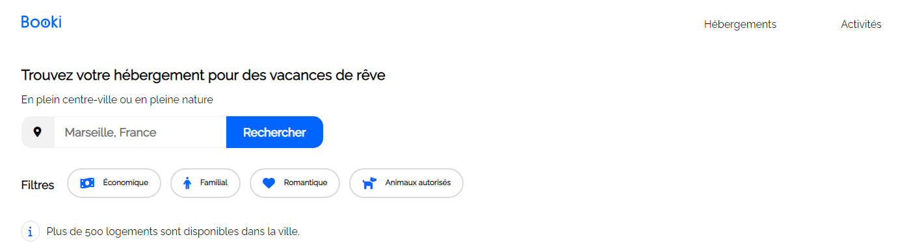
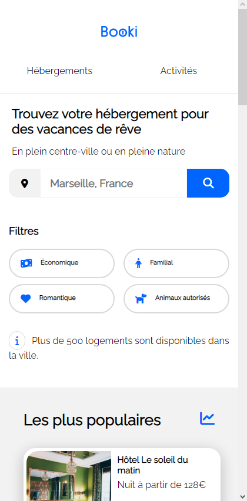

#  Booki

[Lien vers la page web](https://booki-oceanebrl.vercel.app)

> Booki est un projet fictif. Il s'agit du second projet de la  formation développeur web d'OpenClassrooms. La maquette et l'idée leurs appartiennent.

## Scénario


Une entreprise souhaite développer un site permettant aux usagers de trouver des hébergements et des activités dans la ville de leur choix. Ici, on doit se charger d'intégrer l'interface, grâce à des  maquettes. Le site est entièrement  responsive.

## Maquette
Vous pouvez trouver une copie de la maquette figma [ici](https://www.figma.com/file/JC2tUkeNYciWE2txV8O873/Maquettes-Booki-(desktop%2C-mobile%2C-tablette)-(Copy)?node-id=3-0&t=c77jqynIVqcP5fBF-0).





## Notes de synthèse

* La partie recherche n'est pas fonctionnelle, mais doit être prête pour l'avenir du site, en l’occurrence faire en sorte qu'à l'avenir les usagers puissent sélectionner des hébergements dans la ville de leur choix (*ici pour le moment,Marseille*)
* La navigation du header (*ou en-tête*), Hébergements et Activités, sont des liens. Ils renvoient tous les deux vers la partie associée.
* Les cartes sont des liens, ils ne mènent nul-part pour le moment, mais on peut facilement le deviner.
* Les filtres ne sont pas fonctionnels (*dû à l'exclusivité HTML et CSS*), mais doivent tout de même changer aux hover (*ou au survole de la souris*).

## Contraintes  techniques

* Aucune bibliothèque, préprocesseur ou framework est utilisé.
* Le site est  entièrement en HTML et CSS only.
* Le site doit être entièrement responsive.

## Organisation du repos

```
assets
```
Vous pouvez trouver ici toutes les images utilisées. Elles sont réparties dans différents fichiers.

```
assets_description
```
Ce sont simplement les images utilisées dans README.md.

```
css
```
Vous trouverez ici tout le CSS. Il se compose que d'un seul fichier. À partir de la `ligne 267` vous pouvez y trouver également les média queries.

```
index.html
```
Tout simplement l'index du site. Booki ne comporte qu'une page comme vous pouvez le voir,  donc nous n'avons qu'un seul fichier html ici.

### Octobre 2022
